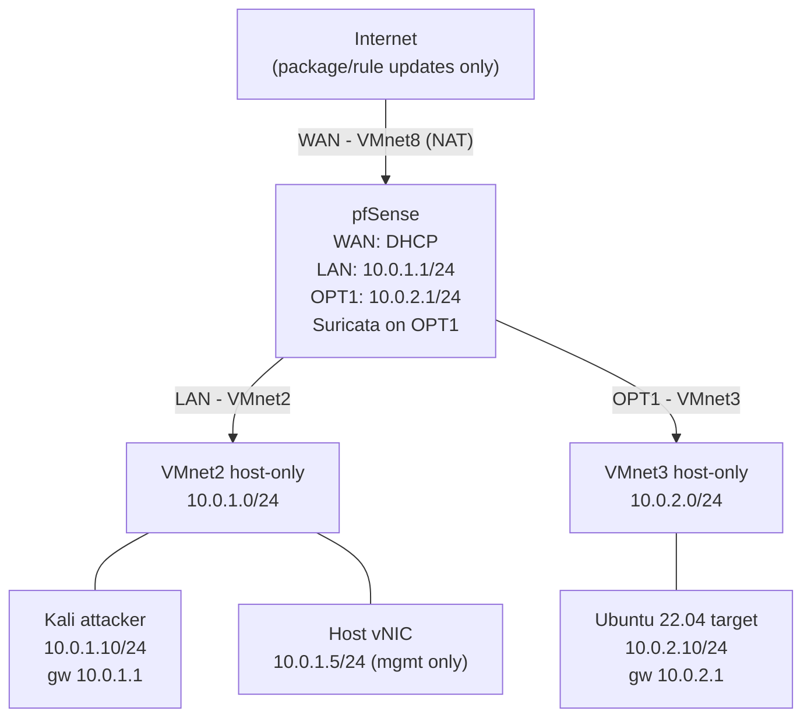

# Lab Setup

Isolated VMware lab with pfSense as router/firewall so that all attack traffic is visible to Suricata. This document describes the environment used to generate evidence for the cases in this repository.

## Topology

```text
                        ┌──────────────────────────────────┐
                        │              Internet            │
                        │  (package/rule updates only)     │
                        └────────────────┬─────────────────┘
                                         │ WAN - VMnet8 (NAT)
                        ┌────────────────┴─────────────────┐
                        │              pfSense             │
                        │  WAN : DHCP (192.168.224.x)      │
                        │  LAN : 10.0.1.1/24               │
                        │  OPT1: 10.0.2.1/24               │
                        │  Suricata enabled on OPT1        │
                        └───────┬──────────────────┬───────┘
                                │                  │
                 LAN (VMnet2)   │                  │   OPT1 (VMnet3)
                                │                  │
        ┌──────────────────────────────┐  ┌──────────────────────────────┐
        │  Segment LAN - 10.0.1.0/24   │  │  Segment OPT1 - 10.0.2.0/24  │
        │  VMnet2, host-only           │  │  VMnet3, host-only           │
        └──────────┬───────────────┬───┘  └──────────┬───────────────────┘
                   │               │                 │
   ┌────────────────────────┐  ┌──────────────────┐  ┌────────────────────────────┐
   │  Kali (attacker)       │  │  Host vNIC       │  │  Ubuntu 22.04 (target)     │
   │  10.0.1.10/24          │  │  10.0.1.5/24     │  │  10.0.2.10/24              │
   │  gw: 10.0.1.1          │  │  mgmt only       │  │  gw: 10.0.2.1              │
   │  nmap, hydra, tcpdump  │  └──────────────────┘  │  OpenSSH, tcpdump          │
   └────────────────────────┘                        └────────────────────────────┘
```



### Why this topology

- **Two separate host-only segments.** If the attacker and the target shared one subnet, their traffic would flow VM-to-VM directly and bypass pfSense — Suricata would see nothing. Separate subnets force routing through pfSense.
- **NAT only on pfSense WAN**, so the firewall can download packages and rule updates. The attacker and target segments have no direct internet path.

## Components

- Hypervisor: VMware Workstation (VirtualBox equivalents at the bottom)
- Router/firewall: pfSense CE with the Suricata package
- Attacker VM: Kali Linux
- Target VM: Ubuntu Server 22.04 (OpenSSH, tcpdump)
- Networks: VMnet8 (NAT), VMnet2 + VMnet3 (host-only)

## Addressing

| Device | NIC | VMware network | IP | Gateway |
|---|---|---|---|---|
| pfSense | WAN | VMnet8 (NAT) | DHCP (e.g. 192.168.224.x) | VMware NAT gateway |
| pfSense | LAN | VMnet2 | 10.0.1.1/24 | — |
| pfSense | OPT1 | VMnet3 | 10.0.2.1/24 | — |
| Kali | eth0 | VMnet2 | 10.0.1.10/24 | 10.0.1.1 |
| Ubuntu | eth0 | VMnet3 | 10.0.2.10/24 | 10.0.2.1 |
| Host (optional) | vAdapter | VMnet2 | 10.0.1.5/24 | — |

DNS for both VMs: their pfSense interface IP (pfSense DNS forwarder).

## VMware network configuration

1. Open **Virtual Network Editor** (run as administrator).
2. Keep VMnet8 as NAT (default).
3. Add VMnet2 and VMnet3 as **host-only**. Disable DHCP on both (static IPs are used).
4. Optionally enable "Connect a host virtual adapter" on VMnet2 for management from the host.

## VM NIC assignment

| VM | NIC 1 | NIC 2 | NIC 3 |
|---|---|---|---|
| pfSense | VMnet8 (WAN) | VMnet2 (LAN) | VMnet3 (OPT1) |
| Kali | VMnet2 | — | — |
| Ubuntu | VMnet3 | — | — |

## Reproduction steps

1. Configure the networks in Virtual Network Editor as above.
2. Install pfSense with 3 NICs. Assign WAN = first NIC, LAN = second, OPT1 = third (Interfaces > Assignments; shown as `em0/em1/em2` or `vtnet*`).
3. Set LAN to 10.0.1.1/24 and OPT1 to 10.0.2.1/24.
4. Configure Kali (adjust the connection name to match `nmcli con show`):

```bash
sudo nmcli con mod "Wired connection 1" ipv4.method manual \
  ipv4.addresses 10.0.1.10/24 ipv4.gateway 10.0.1.1 ipv4.dns 10.0.1.1
sudo nmcli con up "Wired connection 1"
```

5. Configure Ubuntu (`/etc/netplan/00-installer-config.yaml`), then `sudo netplan apply`:

```yaml
network:
  version: 2
  ethernets:
    eth0:
      addresses: [10.0.2.10/24]
      routes:
        - to: default
          via: 10.0.2.1
      nameservers:
        addresses: [10.0.2.1]
```

6. Verify routing goes through pfSense:

```bash
# from Kali
ping 10.0.2.10
traceroute 10.0.2.10    # expect: 10.0.1.1 -> 10.0.2.10
```

7. Install Suricata (System > Package Manager), enable it on OPT1 (Services > Suricata), and select the **Emerging Threats Open** ruleset.
8. Optional hardening: add a LAN rule blocking attacker → WAN so the attacker segment has no internet at all.

## Running the simulations (isolated lab only)

### Case 01 — port scan

```bash
# on Ubuntu (target): start capture
sudo tcpdump -i eth0 -w 01-port-scan.pcap

# on Kali (attacker)
nmap -sS -p 1-1024 10.0.2.10

# stop tcpdump; also export Suricata alerts from pfSense
```

### Case 02 — SSH brute force

```bash
# on Kali (attacker), low volume, lab wordlist only
hydra -l adi -P small-wordlist.txt ssh://10.0.2.10 -t 4

# on Ubuntu (target): extract the relevant log excerpt
sudo grep "Failed password" /var/log/auth.log | tail -40 > 02-auth-bruteforce.log
```

### Case 03 — DNS / phishing domains

No live attack is needed. Use a curated list of suspicious domains (e.g. exported from PhishTank / URLhaus) and feed it to the analysis script in `case-03-dns-phishing/`.

## Verifying Suricata sees the attack

After the case-01 scan, check Services > Suricata > Alerts on pfSense for ET SCAN entries (e.g. "ET SCAN Potential TCP Scan"). Export the alert log as additional case-01 evidence alongside the target-side pcap.

## Safety

- Attacker and target live on host-only segments; the only internet path is pfSense WAN, which is blocked for the attacker by the optional rule.
- Never scan outside 10.0.1.0/24 and 10.0.2.0/24.
- Revert VMs to snapshots after each session; redact secrets before committing evidence.

## VirtualBox equivalents

| VMware | VirtualBox |
|---|---|
| VMnet8 (NAT) | NAT Network |
| VMnet2 / VMnet3 (host-only) | Host-only Adapter / Internal Network |
| Virtual Network Editor | Host Network Manager |
